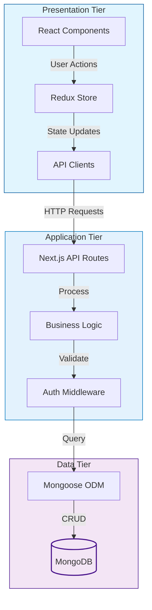

# 🛍️ EasyShop - Modern E-commerce Platform

[](https://nextjs.org/)
[](https://www.typescriptlang.org/)
[](https://www.mongodb.com/)
[](https://redux.js.org/)
[](LICENSE)

EasyShop is a modern, full-stack e-commerce platform built with Next.js 14, TypeScript, and MongoDB. It features a beautiful UI with Tailwind CSS, secure authentication, real-time cart updates, and a seamless shopping experience.

## ✨ Features

- 🎨 Modern and responsive UI with dark mode support
- 🔐 Secure JWT-based authentication
- 🛒 Real-time cart management with Redux
- 📱 Mobile-first design approach
- 🔍 Advanced product search and filtering
- 💳 Secure checkout process
- 📦 Multiple product categories
- 👤 User profiles and order history
- 🌙 Dark/Light theme support

## 🏗️ Architecture

EasyShop follows a three-tier architecture pattern:

### 1. Presentation Tier (Frontend)
- Next.js React Components
- Redux for State Management
- Tailwind CSS for Styling
- Client-side Routing
- Responsive UI Components

### 2. Application Tier (Backend)
- Next.js API Routes
- Business Logic
- Authentication & Authorization
- Request Validation
- Error Handling
- Data Processing

### 3. Data Tier (Database)
- MongoDB Database
- Mongoose ODM
- Data Models
- CRUD Operations
- Data Validation



### Key Features of the Architecture
- **Separation of Concerns**: Each tier has its specific responsibilities
- **Scalability**: Independent scaling of each tier
- **Maintainability**: Modular code organization
- **Security**: API routes handle authentication and data validation
- **Performance**: Server-side rendering and static generation
- **Real-time Updates**: Redux for state management

### Data Flow
1. User interacts with React components
2. Actions are dispatched to Redux store
3. API clients make requests to Next.js API routes
4. API routes process requests through middleware
5. Business logic handles data operations
6. Mongoose ODM interacts with MongoDB
7. Response flows back through the tiers

## 🚀 Getting Started On AWS EC2 To test EasyShop - Modern E-commerce Platform Running

### Prerequisites

> [!NOTE]
> Make sure you have the following installed:
> - Node.js (v18 or higher)
> - npm (v9 or higher)
> - MongoDB (v7 or higher)

### Prerequisites Installation Steps
1. Node.js
```bash
sudo apt install nodejs -y
node -v
```

2. npm
```bash
sudo apt install npm -y
npm -v
```

3. MongoDB (Import the public key)

```bash
curl -fsSL https://www.mongodb.org/static/pgp/server-8.0.asc |    sudo gpg -o /usr/share/keyrings/mongodb-server-8.0.gpg    --dearmor
node -v
```
Create the list file for Ubuntu
```bash
echo "deb [ arch=amd64,arm64 signed-by=/usr/share/keyrings/mongodb-server-8.0.gpg ] https://repo.mongodb.org/apt/ubuntu noble/mongodb-org/8.0 multiverse" | sudo tee /etc/apt/sources.list.d/mongodb-org-8.0.list
``` 
Reload the package database $ Install MongoDB 
```bash
sudo apt-get update
sudo apt-get install -y mongodb-org
mongodb -v
```

### Installation Steps

1. Clone the repository
```bash
git clone https://github.com/iemafzalhassan/EasyShop.git
cd EasyShop
```

2. Install dependencies
```bash
npm install
npm install tsx --save-dev
```

3. Set up environment variables
```bash
cp .env.example .env.local
```

> [!IMPORTANT]
> Create a `.env.local` file in the root directory with the following configuration:
> ```env
> # Database Configuration
> MONGODB_URI=mongodb://localhost:27017/easyshop
> 
> # Next.js Configuration
> NEXTAUTH_URL=http://localhost:3000
> NEXT_PUBLIC_API_URL=http://localhost:3000/api
> 
> # Authentication
> JWT_SECRET=your-secure-jwt-secret-key
> ```
> 
> **Note**: Replace `your-secure-jwt-secret-key` with a secure secret key for JWT token generation. 
> You can generate one using [JWT Builder Tool](http://jwtbuilder.jamiekurtz.com/) or any other secure JWT generator.


> [!IMPORTANT]
> Create a `.env.local` file in the root directory with the following configuration:
> ```env
> ### Database Configuration On AWS EC2 Change the IP Address to local host
> MONGODB_URI=mongodb://<EC2 IP ADDRESS>:27017/easyshop
> 
> # Next.js Configuration
> NEXTAUTH_URL=http://<EC2 IP ADDRESS>:3000
> NEXT_PUBLIC_API_URL=http://<EC2 IP ADDRESS>:3000/api
> 
> # Authentication
> JWT_SECRET=your-secure-jwt-secret-key
> ```
> 
> **Note**: Replace `your-secure-jwt-secret-key` with a secure secret key for JWT token generation. 
> You can generate one using [JWT Builder Tool](http://jwtbuilder.jamiekurtz.com/) or any other secure JWT generator. 
 


### JWT token generation
```bash
openssl rand -hex 32
```

### Running the Application

Follow these commands in sequence:

1. First, run the database migrations to set up your database with initial data:
```bash
npm run migrate
```

2. For development:
```bash
# Start the development server with hot reload
npm run dev
```

3. For production:
```bash
# Build the application
npm run build

# Start the production server
npm start
```

> [!NOTE]
> - Development server runs on: http:// EC2-IP:3000
> - The migrate command only needs to be run once when setting up the project
> - Always run `npm run build` before `npm start` in production
